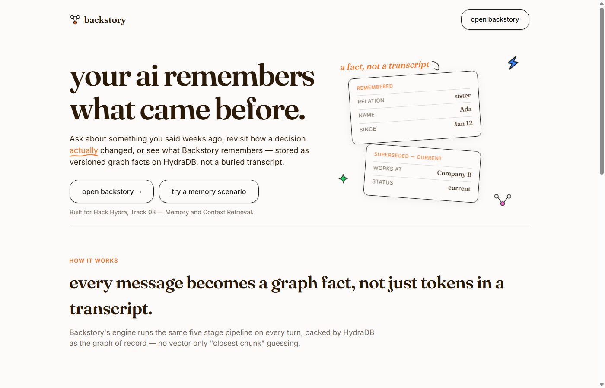

<p align="center">
  
</p>

<h1 align="center">Backstory</h1>

<p align="center">
  Graph native long term memory for conversational agents, built on HydraDB.
</p>

<p align="center">
  <a href="https://backstory.fly.dev/">Live demo</a> ·
  <a href="#evaluation">Evaluation</a> ·
  <a href="#deploy">Deploy</a> ·
  <a href="docs/ARCHITECTURE.md">Architecture</a>
</p>

<p align="center">
  
  
  
</p>

Backstory is a memory layer for AI assistants. Tell it something once, come
back weeks later, and it still knows what changed, what got superseded, and
when it genuinely does not have an answer. It was built for Hack Hydra, Track
03, Memory and Context Retrieval, and every fact it stores lives as a real
node and edge in HydraDB, not a buried transcript or a nearest neighbor
guess.

This repository does not claim an official LongMemEval S score. The commands
below are the ones this project actually ships and can back up.

## Contents

- [How it works](#how-it-works)
- [Requirements](#requirements)
- [Run HydraDB locally](#run-hydradb-locally)
- [Install and smoke test](#install-and-smoke-test)
- [Engine tests](#engine-tests)
- [Try the product](#try-the-product)
- [Evaluation](#evaluation)
- [Deploy](#deploy)
- [Architecture](#architecture)
- [Known issues](docs/KNOWN_ISSUES.md)
- [License](#license)

## How it works

Every message goes through the same pipeline. The engine extracts subject,
predicate, and object atoms from what was said, resolves entities against
existing ones by exact key or alias, versions the result so a new fact can
supersede or contradict an older one instead of silently overwriting it, and
retrieves answers through a real graph traversal rather than a similarity
search. When the evidence is missing or the question rests on something that
was never actually said, it abstains instead of guessing.

HydraDB, specifically its `graph-node` process, is the source of truth for
users, sessions, facts, entities, and the supersede and contradict edges
between them. A small SQLite sidecar exists only to allocate integer ids and
hold a rebuildable lexical index. It is never allowed to answer a question on
its own, and Hydra Cloud is not used anywhere in this project.

## Requirements

- Docker Desktop
- Python 3.11 or newer

## Run HydraDB locally

```powershell
cd backstory
docker compose up -d
```

Wait until `http://127.0.0.1:9090/readyz` returns 200.

That default is `CLOUD_PROVIDER=local`, which is fine for smoke tests
and the four demos. A long ingest can die the same way as
[hydradb#81](https://github.com/hydra-db/hydradb/issues/81). For BEAM or
the 500-question set, use the S3 override:

```powershell
copy .env.example .env
# fill AWS_* then:
docker compose -f docker-compose.yml -f docker-compose.s3.yml up -d
```

## Install and smoke test

```powershell
python -m pip install -e ".[dev]"
python -m backstory.tools.smoke_hydradb
```

The smoke script writes real nodes and edges, queries current versus
historical state, checks that supersede and contradict edges behave
correctly, and confirms that unsupported Cypher patterns such as `IS NULL`
and undirected matches are rejected by the parser. It can be rerun after a
container restart to confirm the data actually persisted:

```powershell
docker compose restart hydradb
python -m backstory.tools.smoke_hydradb --persist-only
```

If the smoke test fails, the fix belongs in the HydraDB integration. This
project does not fall back to Postgres or any other store.

## Engine tests

```powershell
pytest -q
```

## Try the product

```powershell
python -m backstory.demo.load_demo
python -m backstory.api.app
```

Open `http://127.0.0.1:8000` for the marketing landing page, or go straight
to `http://127.0.0.1:8000/app` for the live product: ask questions, tell it
things to remember, inspect the evidence behind an answer, and browse the
timeline of how a fact changed over time. The landing page's scenario cards
link to `/app?demo=<name>`, which signs you in and runs that scenario
automatically. Every account gets its own private memory. Nobody sees another
account's facts, including the demo scenarios. Seeded demos always
write under `demo:<account>` (`demo:demo-user-ui` for the CLI), never
into a real user's graph.

## Evaluation

The smallest offline run that matches the official shape, with no large
haystacks and no OpenAI key required:

```powershell
python -m backstory.eval.run_smoke_eval
```

The full LongMemEval oracle set can be downloaded from the
[cleaned dataset on Hugging Face](https://huggingface.co/datasets/xiaowu0162/longmemeval-cleaned)
into `data/lme/`. Everything below is driven by `backstory.eval.run_official`,
which ingests each instance's sessions in date order, asks Backstory, writes
a `{question_id, hypothesis}` jsonl file, and, if `OPENAI_API_KEY` is set,
calls the official judge itself.

```powershell
# One question, ingest and ask only, no judge call
python -m backstory.eval.run_official --dataset data/lme/longmemeval_oracle.json --ids 6aeb4375 --skip-official-judge

# A stratified 12 question slice, two per official type, drawn from the full 500
python -m backstory.eval.slice_lme --dataset data/lme/longmemeval_oracle.json --per-type 2 --out data/lme/oracle_strat12.json
python -m backstory.eval.run_official --dataset data/lme/oracle_strat12.json --limit 0 --out-dir runs/lme/strat12 --skip-official-judge

# Score existing hypotheses with the official judge (needs OPENAI_API_KEY)
python -m backstory.eval.run_official --judge-only --hyp runs/lme/strat12/hyp_backstory.jsonl --dataset data/lme/oracle_strat12.json

# The same slice, ingest then official judge (needs OPENAI_API_KEY)
python -m backstory.eval.run_official --dataset data/lme/oracle_strat12.json --limit 0 --out-dir runs/lme/strat12

# The full LongMemEval S set of 500 questions (slow, needs OPENAI_API_KEY,
# and a non-local Hydra store — see docker-compose.s3.yml)
python -m backstory.eval.run_official --dataset data/lme/longmemeval_oracle.json --limit 0
```

Each run writes `runs/lme/<out-dir>/hypotheses.jsonl`, a per-question trace
of retrieval and reasoning, and `summary_unofficial.json`, which is a loose
token overlap diagnostic and not the scored metric. The judge's own output
lands next to the hypothesis file, written by
`vendor/longmemeval/evaluate_qa.py`, the official scorer. It requires
`OPENAI_API_KEY`, and the internal diagnostic is never a substitute for it.

To compare Backstory against a naive graph ablation and a session level
retrieval baseline on the same slice:

```powershell
python -m backstory.eval.run_compare
```

This writes `runs/lme/strat12/compare.json`. See
[docs/LONGMEMEVAL_VALIDATION.md](docs/LONGMEMEVAL_VALIDATION.md) for the last
measured numbers and their caveats. Those numbers are unofficial until
`evaluate_qa.py gpt-4o` actually runs.

### LongMemEval-V2

LME-V2 is a web/enterprise *agent trajectory* benchmark, not a newer
LongMemEval-S. This repo ships an adapter that flattens trajectory text
into sessions so the same engine can be probed. It does **not** run the
official LME-V2 harness and ignores screenshots.

```powershell
python -m backstory.eval.run_lme_v2 --data-root data/lme-v2 --tier small --limit 2
```

If `data/lme-v2/questions.jsonl` is missing, the command exits 0 and
tells you what to download. Adapter output is not an LME-V2 score.

### BEAM

[BEAM](https://github.com/mohammadtavakoli78/BEAM) probes ten long term
memory abilities over multi session conversations, seven of which map
directly onto mechanisms this project implements: abstention,
contradiction resolution, knowledge update, multi session reasoning,
temporal reasoning, event ordering, and preference following. Each
conversation in the smallest tier is roughly 125,000 tokens spread over
three dated sessions, which is the shape Backstory is built for.

```powershell
python -m backstory.eval.beam_download --tier 100K --ids 1,2,3
python -m backstory.eval.run_beam --tier 100K
```

The runner ingests each conversation as dated sessions, asks all twenty
probing questions, and scores answers with an LLM against BEAM's own
published per-question rubrics. Those results are reported as "judged
against BEAM rubrics" and are deliberately not called official BEAM
scores: BEAM's `src/evaluation/compute_metrics.py` additionally requires
sentence-transformers and a LangChain model. Per-question records,
including each rubric and verdict, are written to
`runs/beam/beam_<tier>_hypotheses.jsonl` so the official scorer can be
run over them later.

## Deploy

A live instance runs at [backstory.fly.dev](https://backstory.fly.dev/), with
the product itself at `/app` behind Google sign in.

HydraDB's `graph-node` process only binds to IPv4, but Fly's private network
between separate apps is IPv6 only. This was confirmed directly by reading
`/proc/net/tcp6` on a standalone HydraDB machine, which showed nothing
listening on the private address except Fly's own SSH agent. Because of
that, this project does not deploy as two Fly apps talking over internal DNS
the way `docker compose` runs two containers locally. Instead,
`deploy/combined.Dockerfile` builds a single image, the official HydraDB
image with Python installed on top, that runs both `graph-node` and
`uvicorn` in the same machine over `127.0.0.1`, orchestrated by
`deploy/combined-entrypoint.sh`. One Fly volume holds both HydraDB's data and
the sidecar's SQLite file. Local development is unaffected, since Docker's
bridge network does not have this mismatch.

```powershell
flyctl apps create backstory
flyctl volumes create backstory_data --app backstory --region iad --size 3
flyctl secrets set --app backstory `
  SESSION_SECRET=(python -c "import secrets; print(secrets.token_urlsafe(32))") `
  SESSION_HTTPS_ONLY=true `
  GOOGLE_CLIENT_ID=... `
  GOOGLE_CLIENT_SECRET=...
flyctl deploy --config fly.toml --app backstory
```

Google sign in requires `https://<app>.fly.dev/auth/google/callback` to be
added as an authorized redirect URI in Google Cloud Console, alongside the
local one used for development.

Object storage is Tigris, Fly's S3-compatible store, created with
`fly storage create`. This is deliberate rather than incidental:
HydraDB's manifest garbage collector needs conditional puts that the
local filesystem backend does not implement, which makes writes fail
permanently under sustained load. See
[docs/KNOWN_ISSUES.md](docs/KNOWN_ISSUES.md) for the upstream citation,
the call path that makes `CLOUD_PROVIDER=aws` work from the published
image, and how this was verified.

## Architecture

See [docs/ARCHITECTURE.md](docs/ARCHITECTURE.md) for the full, live validated
design. If HydraDB were replaced with a vector store, this project would
lose current versus historical lookup, supersede lineage, contradiction as a
first class structure, and constraint aware abstention that is not simply
"nearest neighbor returned nothing."

## License

Backstory is MIT licensed. HydraDB is AGPL 3.0 and runs as a separate
service. See [NOTICE](NOTICE) for details.
